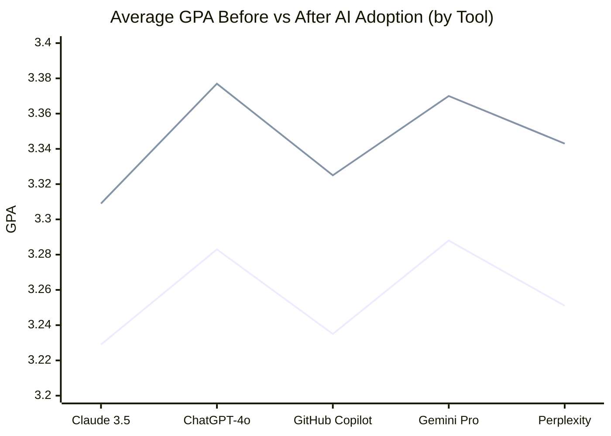
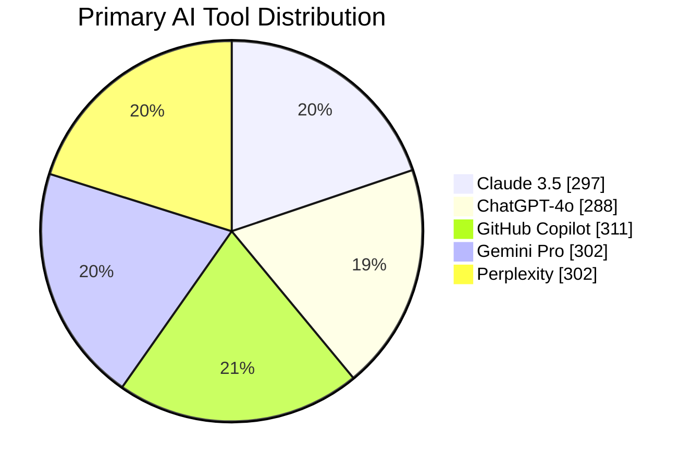
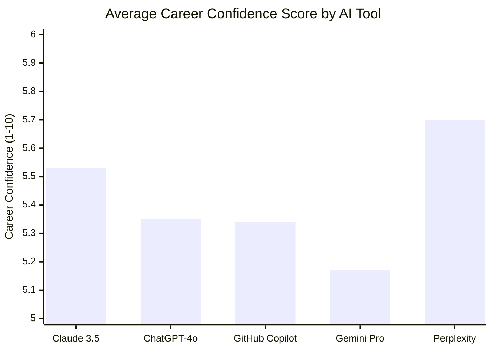
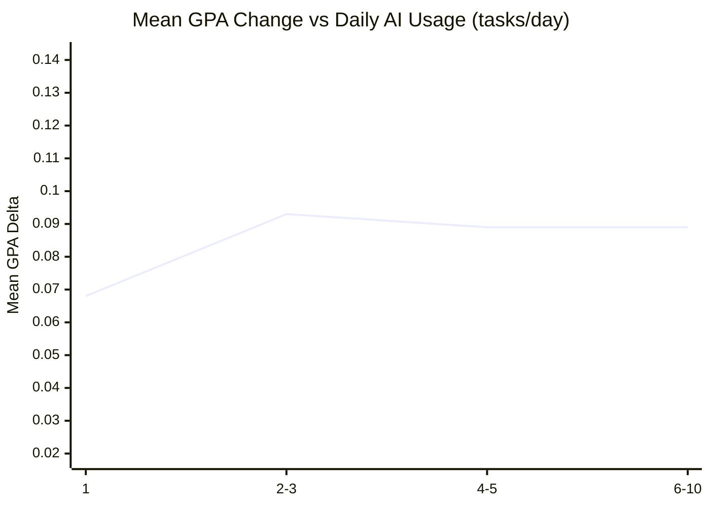
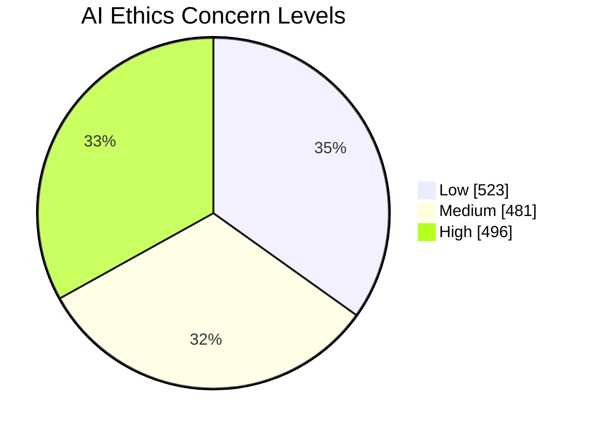

# AI Impact on Student Life
## 2026 Cohort Analysis Report

> **Prepared:** April 17, 2026
> **Sample:** 1,500 students · 5 AI tools · 6 majors
> **Source:** `AI_Impact_Student_Life_2026.csv`

---

## Executive Summary

> **Conclusion.** AI adoption produced a small but measurable academic gain across the 2026 cohort: **59.6% of students improved their GPA**, with a mean uplift of **+0.088 points**. Differences between the five major AI tools are modest (≤0.01 GPA points spread), and student career confidence is largely independent of how intensively AI is used. The headline strategic concern is ethics: roughly **33.1% of students report High concern** about AI's role in academic work.

### Key metrics at a glance

| Metric | Value |
|---|---|
| Students analyzed | 1,500 |
| AI tools compared | 5 |
| Academic majors represented | 6 |
| Mean GPA improvement | +0.088 |
| Improvement rate | 59.6% |
| Decline rate | 20.1% |
| Top-performing tool (GPA gain) | ChatGPT-4o (+0.094) |
| Top-performing tool (career confidence) | Perplexity (5.7/10) |
| High ethics concern | 33.1% of cohort |

### Headline findings

1. **Academic uplift is real but modest.** Gains outnumber declines roughly 3.0-to-1, but the average improvement is on the order of one-tenth of a GPA point.
2. **No tool is a clear winner.** All five tools cluster within a 0.01-point band on mean GPA gain. Tool selection is not the dominant variable.
3. **Heavier usage ≠ better outcomes.** GPA gains do not increase monotonically with daily-usage frequency; intensity is not the lever.
4. **Career confidence is decoupled from usage.** Correlations between confidence and usage variables are near zero (|r| ≤ 0.03).
5. **Ethics is the most actionable risk signal.** A near-even Low/Medium/High split, with 33.1% in High, indicates institutional guidance is overdue.

---

## 1. Academic Impact

> **Conclusion.** AI adoption shifts the cohort meaningfully, but unevenly. About **60% of students improve**, while the remaining ~40% split roughly evenly between unchanged (20%) and declined (20%).

| Outcome | Students | Share of cohort |
|---|---|---|
| GPA improved | 894 | 59.6% |
| GPA unchanged | 305 | 20.3% |
| GPA declined | 301 | 20.1% |
| **Mean delta** | — | **+0.088** (range -0.10 to +0.30) |

*Lower line: baseline GPA. Upper line: post-AI GPA.*

---

## 2. Tool Performance

> **Conclusion.** No tool dominates. The top-to-bottom spread on mean GPA gain is just 0.01 points across all five tools. Tool choice matters less than how the tool is used.

| Tool | n | Mean baseline GPA | Mean post-AI GPA | Mean GPA delta | Mean career score | Mean hrs saved/wk |
|---|---|---|---|---|---|---|
| Claude 3.5 | 297 | 3.229 | 3.309 | 0.08 | 5.53 | 8.28 |
| ChatGPT-4o | 288 | 3.283 | 3.377 | 0.094 | 5.35 | 8.33 |
| GitHub Copilot | 311 | 3.235 | 3.325 | 0.091 | 5.34 | 8.44 |
| Gemini Pro | 302 | 3.288 | 3.37 | 0.082 | 5.17 | 8.64 |
| Perplexity | 302 | 3.251 | 3.343 | 0.092 | 5.7 | 8.85 |

**Best for academic gain:** ChatGPT-4o (+0.094).
**Best for career confidence:** Perplexity (5.7/10).

### Market share across the cohort

### Career confidence by tool

---

## 3. Usage Intensity

> **Conclusion.** GPA gains do not scale with daily usage. The relationship across usage buckets rises only marginally — implying that *how* AI is used matters more than *how much*.

| Daily usage bucket | n | Mean GPA delta | Mean career score |
|---|---|---|---|
| 1 | 157 | 0.068 | 5.17 |
| 2-3 | 322 | 0.093 | 5.41 |
| 4-5 | 302 | 0.089 | 5.37 |
| 6-10 | 719 | 0.089 | 5.49 |

---

## 4. Career Confidence vs. AI Usage Patterns

> **Conclusion.** Career confidence is statistically independent of AI usage. Correlations with daily usage, time saved, and GPA change are all weak (|r| < 0.05). Confidence appears to be driven by factors outside the data captured here.

### Correlations

| Pair | Pearson r |
|---|---|
| Career_Confidence_Score vs Task_Frequency_Daily | 0.025 |
| Career_Confidence_Score vs Time_Saved_Hours_Weekly | 0.002 |
| Career_Confidence_Score vs GPA_Delta | 0.009 |
| Career_Confidence_Score vs GPA_Baseline | 0.019 |

### Mean career confidence by primary usage case

| Usage case | n | Mean career score | Mean GPA delta |
|---|---|---|---|
| Brainstorming | 286 | 5.26 | 0.088 |
| Code Debugging | 264 | 5.48 | 0.095 |
| Essay Drafting | 301 | 5.37 | 0.088 |
| Exam Prep | 341 | 5.62 | 0.083 |
| Literature Review | 308 | 5.34 | 0.087 |

---

## 5. Ethics Sentiment

> **Conclusion.** Ethics concern is the clearest risk signal in the dataset. The Low/Medium/High split is near-even, meaning institutional posture cannot assume student comfort with AI.

| Concern level | Students | Share of cohort |
|---|---|---|
| Low | 523 | 34.9% |
| Medium | 481 | 32.1% |
| High | 496 | 33.1% |

### Concern distribution by tool

| Tool | Low | Medium | High |
|---|---|---|---|
| Claude 3.5 | 110 | 99 | 88 |
| ChatGPT-4o | 96 | 94 | 98 |
| GitHub Copilot | 110 | 97 | 104 |
| Gemini Pro | 108 | 94 | 100 |
| Perplexity | 99 | 97 | 106 |

---

## Strategic Recommendations

### For educators and administrators

1. **Adopt a tool-agnostic policy.** With ≤0.01 GPA points separating the best and worst tools, mandating a specific platform is unjustified by the evidence. Focus governance on usage practices, not vendor selection.
2. **Make ethics guidance a first-class deliverable.** 33.1% of students hold High ethics concern. Publish clear, course-level guidance on permitted AI use; integrate academic-integrity discussion into syllabi.
3. **Invest in usage-quality coaching, not access expansion.** Heavier usage does not produce better outcomes. Resources are better spent teaching students *when* and *how* to apply AI than expanding seat licenses.
4. **Treat career confidence as a separate program.** Confidence does not correlate with AI usage in this data. Career outcomes need dedicated programming (mentorship, portfolio review, internships) — they will not arrive as a byproduct of AI adoption.

### For students

1. **Treat AI as one of several tools.** 20.1% of students saw GPA decline after adopting AI. Adoption is not automatically beneficial; match the tool to the task.
2. **Quality of use beats hours of use.** Buckets of daily-usage frequency show no clean relationship with GPA gain. Reflective, targeted use outperforms heavy default use.
3. **Build career confidence deliberately.** Confidence will not rise simply because you use AI more. Pursue projects, internships, and mentorship in parallel.

---

## Appendix

### A1. Dataset summary

- **Shape:** 1,500 rows × 12 columns
- **Missing values:** 0
- **Columns:** `Student_ID`, `Age`, `Major`, `Primary_AI_Tool`, `Task_Frequency_Daily`, `Main_Usage_Case`, `GPA_Baseline`, `GPA_Post_AI`, `Time_Saved_Hours_Weekly`, `AI_Ethics_Concern`, `Career_Confidence_Score`, `GPA_Delta`

#### Per-column statistics

| Column | min | max | mean | stdev |
|---|---|---|---|---|
| Age | 18 | 25 | 21.494 | 2.297 |
| Task_Frequency_Daily | 1 | 10 | 5.407 | 2.904 |
| GPA_Baseline | 2.5 | 4.0 | 3.257 | 0.43 |
| GPA_Post_AI | 2.4 | 4.0 | 3.345 | 0.437 |
| Time_Saved_Hours_Weekly | 2 | 15 | 8.51 | 4.07 |
| Career_Confidence_Score | 1 | 10 | 5.417 | 2.844 |

### A2. Career Confidence Score distribution

| Score | Count |
|---|---|
| 1 | 149 |
| 2 | 156 |
| 3 | 148 |
| 4 | 170 |
| 5 | 148 |
| 6 | 156 |
| 7 | 140 |
| 8 | 154 |
| 9 | 137 |
| 10 | 142 |

Cohort mean: **5.417/10** (stdev 2.844).

### A3. Methodology

- GPA delta computed per student as `GPA_Post_AI − GPA_Baseline`, rounded to two decimals to remove floating-point artifacts.
- Daily-usage frequency bucketed as: 1, 2-3, 4-5, 6-10 tasks/day.
- Correlations reported as Pearson's r; values |r| < 0.10 are treated as practically zero.
- All percentages calculated against the full 1,500-student cohort.
- The dataset contains no explicit mental-well-being measure; the closest available signal (`Career_Confidence_Score`) is reported on its own terms in §4 rather than relabeled.
